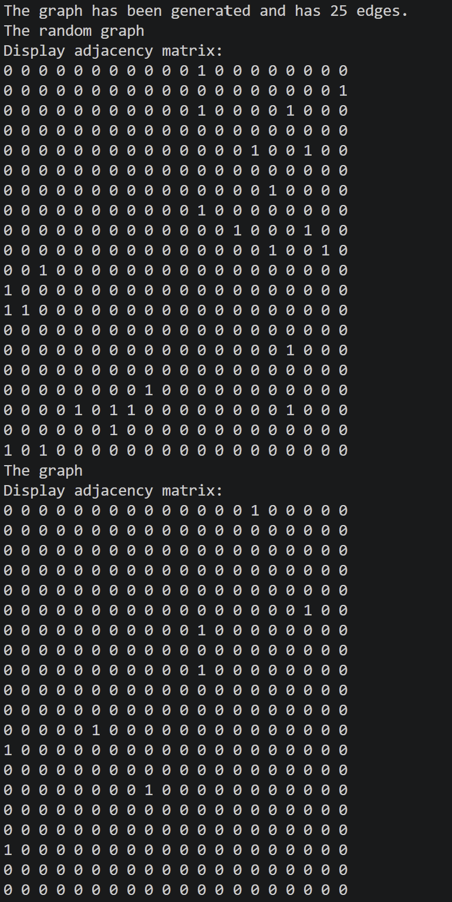
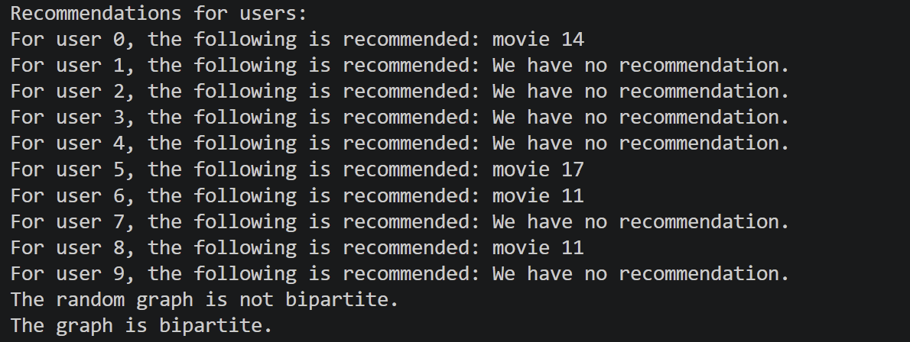

# Streaming Interaction Network

A lightweight C implementation modeling user-content interactions on a video streaming platform using directed bipartite graphs. The project simulates watch history and recommendation flows while providing algorithmic verification of bipartite graph properties.

## Project Overview

Streaming platforms  often model the relationships between viewers and content catalog items using bipartite graphs. In this data structure, entities are partitioned into two disjoint sets:
- **Users** ($U$)
- **Videos** ($V$)

Edges represent directed interactions between these two domains:
- **$U$ $\to$ $V$ (`User -> Video`)**: Represents a watch interaction (the user watched a specific video).
- **$V$ $\to$ $U$ (`Video -> User`)**: Represents an automated recommendation (a video recommended to a user).

Direct connections within the same domain (e.g., `User -> User` or `Video -> Video`) are invalid in this domain model.

---

## Features

- **Directed Bipartite Verification:** Implements graph traversal to check whether an arbitrary directed graph complies with the bipartite condition.
- **Adjacency Matrix Representation:** Models the graph using an adjacency matrix for fast lookups.
- **Predefined Test Graph:** Validates algorithm correctness against a multi-node interaction dataset.
- **Random Graph Generator:** The project includes an automatic graph generator that tests whether the graphs are bipartite.

---

## Output & Demo

Presented below is the configuration of the graph modeling user views and recommendations, as well as the program's execution output.

    // Users -> Videos (Watch Interactions)
    a[6][11] = 1;
    a[5][17] = 1;  
    a[0][14] = 1;  
    a[8][11] = 1;  

    // Videos -> Users (Recommendations)
    a[11][5] = 1;  
    a[17][0] = 1;  
    a[12][0] = 1;  
    a[14][8] = 1;  

