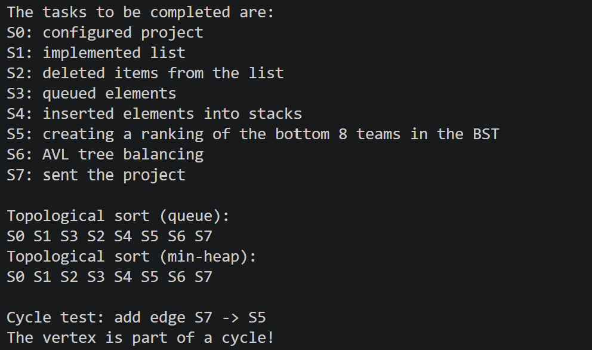

# Task Dependency Scheduler

A simple tool that figures out the correct order to run tasks that depend on each other, using graph algorithms.

## Overview
When building software or running automated pipelines, some tasks cannot start until others are finished. This project models those prerequisites as a Directed Acyclic Graph (DAG) to find a valid step-by-step execution order and catch circular dependency errors.

## Key Features
* **Graph-Based Dependencies:** Maps tasks and prerequisites using adjacency lists and incoming edge (in-degree) counters.
* **Topological Sorting (Kahn's Algorithm):** Finds a valid execution order by running ready tasks through a simple queue.
* **Deadlock / Cycle Detection:** Automatically flags circular dependencies (e.g., Task A needs B, but B needs A) where tasks can never complete.
* **Priority Ordering (Min-Heap):** Uses a priority queue instead of a standard queue so that when several tasks are ready at the same time, the one with the lowest ID runs first.
* **Performance Analysis:** Compares the runtime of the standard queue approach ($O(V + E)$) against the priority heap approach ($O((V + E) \log V)$).

## How It Works & Configuration

The application resolves task dependencies on a directed graph defined directly in `main.c`:

- **Graph Configuration:** The dependency graph is initialized using `creareGraf(8)` (where vertices represent tasks from `0` to `7`), and prerequisites are configured using `adauga_muchie(g, src, dest)` (meaning task `src` must complete before `dest` can start).
- **Execution:** Running the program computes and prints:
  1. A valid linear execution order using standard Kahn's Algorithm (queue-based).
  2. A prioritized order where ready tasks with lower IDs run first (min-heap based).
  3. A cycle/deadlock detection report confirming whether the dependency graph is a valid DAG.

## Output & Demo
Below is a sample terminal output demonstrating the execution :

