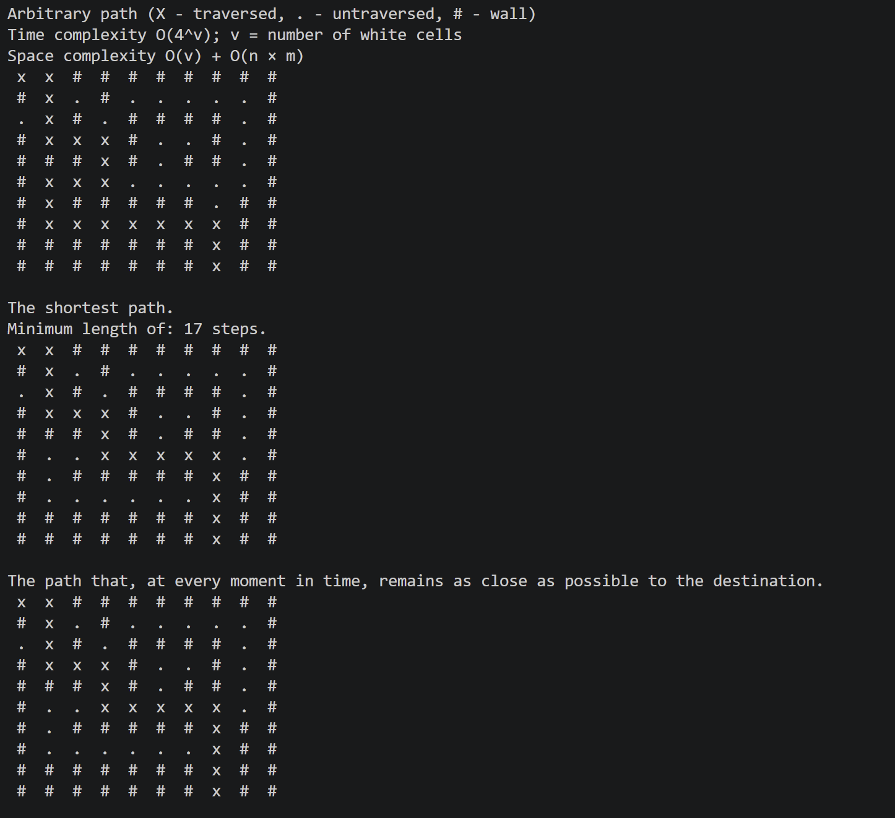

# The maze
## About
A lightweight pathfinding library written in C for solving 2D grid mazes. The project models mazes with walkable and blocked cells to test different path-generation strategies, from exhaustive backtracking to greedy exploration.

## Features
1. Uses *recursive Backtracking (DFS)* with visited-cell tracking to find a valid path between a start point and an exit moving in 4 directions (up, down, left, right).
2. *Optimal Path Resolution*: Evaluates paths to extract the globally optimal trajectory (minimum cell traversal / shortest path).
3. *Greedy / Heuristic Path*: Chooses the next step based on Manhattan distance to prioritize cells physically closer to the exit, even if the overall path ends up longer.
4. *Complexity Analysis*: Compares the trade-offs between finding every possible path versus using a heuristic approach.

## Implementation & Algorithms
- *Grid State*: Represented as a 2D array, marking visited cells along the current recursion branch to prevent loops and cycles.
- *Pruning*: Aborts redundant recursive calls as soon as an invalid or visited cell is reached.
- *Complexity*:
    - Exhaustive Backtracking: Worst-case time complexity is $\mathcal{O}(4^{N \times M})$ when exploring all branches; space complexity is $\mathcal{O}(N \times M)$ for the recursion stack and path storage.
    - Greedy Approach: Sorts available adjacent moves by distance to destination before making the next recursive call, reaching a target quickly without exploring every branch.

## How It Works & Configuration
The application evaluates routes on a predefined grid defined directly in `biblioteca.c`:

- **Grid Configuration:** The maze layout is declared as a static 2D boolean array (`bool labirint[10][10]`), where  `0` marks walkable cells and `1` marks impassable walls.
- **Execution:** Running the program computes and prints:
  1. A valid path between the start poind and the exit using recursive Backtracking.
  2. The shortest route (minimum cell count).
  3. The greedy path based on Manhattan distance to target.

## Output & Demo
Below is a sample terminal output demonstrating the execution and path calculations:

